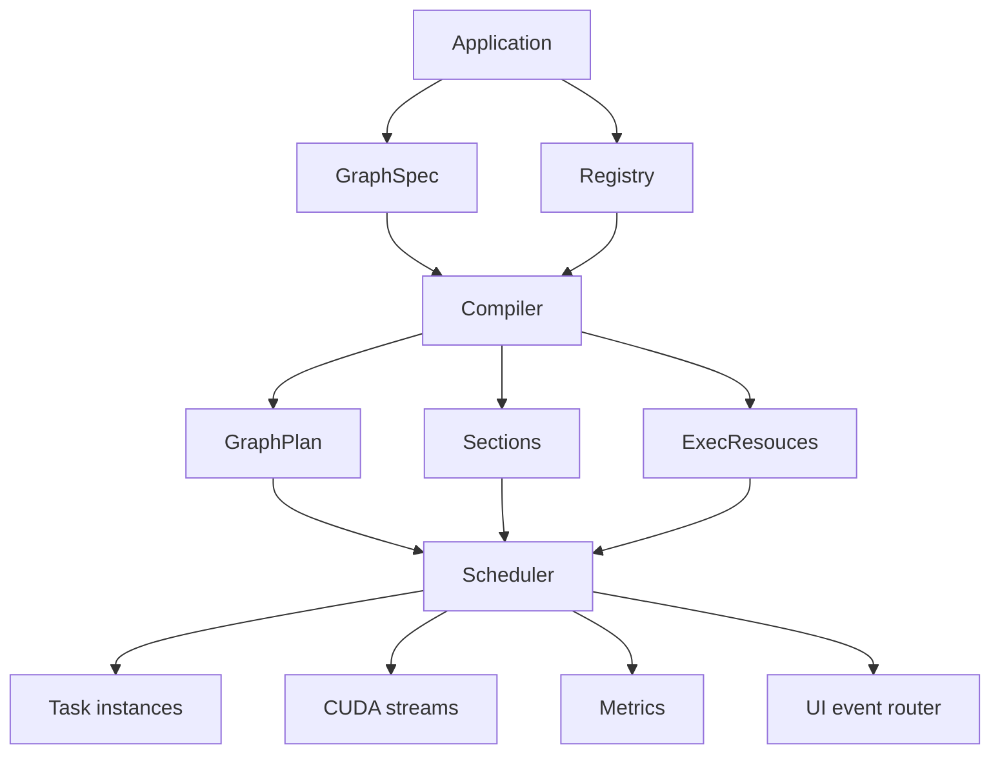

# Architecture

This page describes Holoflow as a set of cooperating runtime layers rather than as isolated classes.

## Layered view



## Core objects

### `GraphSpec`

`GraphSpec` is the user-authored pipeline description. It contains:

- `NodeSpec`
  - `name`: stable node identity
  - `kind`: factory lookup key
  - `settings`: arbitrary JSON settings passed to the factory
  - `debug`: whether debug-oriented graph rendering should include settings
- `EdgeSpec`
  - `out_idx`: output slot of the upstream node
  - `in_idx`: input slot of the downstream node

The graph is declarative only. It has no tasks, no buffers, no streams, and no execution metadata.

### `Registry`

`Registry` maps a node `kind` string to either:

- a synchronous task factory (`ISyncTaskFactory`)
- an asynchronous task factory (`IAsyncTaskFactory`)

This is the bridge between the declarative graph and executable code.

### `CompilerOutput`

Compilation produces three artifacts:

- `GraphPlan`: compiled nodes and edges with inferred tensor metadata and tensor IDs
- `std::vector<Section>`: execution partitions used by the scheduler
- `ExecResouces`: streams, memory blocks, storages, task instances, storage adapters

The compiled output is the boundary between planning and execution.

### `Scheduler`

The scheduler consumes the compiled artifacts and drives the pipeline until stopped. It is responsible for:

- launching section threads
- calling sync and async task entry points
- honoring cooperative cancellation
- releasing owned outputs
- exposing node-level runtime metrics
- routing UI events

## Data path

The data path is defined by three layers of identifiers:

1. Edge-level wiring: `EdgeSpec { out_idx, in_idx }`
2. Tensor identity: compiler-assigned tensor IDs (`tid`)
3. Storage identity: compiler-assigned storage IDs (`sid`)

The distinction matters:

- Two edges can share the same `tid` when they read the same logical output.
- Two tensor IDs can share one `sid` when storage is reused, especially for in-place tasks.

## Control path

Control flows through factories and task interfaces:

1. The compiler looks up the right factory using `NodeSpec::kind`.
2. It calls `infer(...)` to validate settings and derive tensor contracts.
3. It later calls `create(...)` or `update(...)` to materialize the task.
4. The scheduler calls:
   - `ISyncTask::execute(...)` for synchronous nodes
   - `IAsyncTask::try_push(...)` and `IAsyncTask::try_pop(...)` for asynchronous nodes

## Why compilation exists

Holoflow does not execute `GraphSpec` directly because execution requires information that is not explicit in the source graph:

- concrete tensor descriptors for each edge
- buffer aliasing decisions for in-place nodes
- memory allocation and reuse decisions
- stream assignment
- partitioning into independently runnable sections
- instantiated task objects bound to runtime services

Compilation makes those decisions once, so scheduling can stay simple.

## Section architecture

The runtime partitions the graph into `Section` objects. A section groups:

- `sync_topo`: synchronous nodes in topological order
- `async_cons`: asynchronous nodes that produce data for this section
- `async_prod`: asynchronous nodes that consume data from this section
- `stream`: the CUDA stream associated with the section

The scheduler runs one thread per section. Conceptually, a section is a serial pipeline stage with explicit async boundaries on its edges.

## Event architecture

Holoflow includes an event router via `holoflow_event::Router`.

- Each node gets a pair of handles bound by name.
- `SyncCtx` exposes:
  - `event_writer`
  - `event_reader`
- The scheduler also exposes:
  - `ui_try_send(node_id, json)`
  - `ui_try_receive()`

This gives synchronous tasks a side channel for telemetry, control messages, and UI integration without overloading tensor edges with non-tensor data.

## Update architecture

Compilation can reuse a previous `CompilerOutput`:

```cpp
auto first = compiler.compile(graph);
auto next  = compiler.compile(updated_graph, std::move(first));
```

The compiler reuses previous artifacts where practical:

- memory blocks are scavenged by exact `(MemLoc, num_bytes)` match
- CUDA streams are reused section-by-section when available
- tasks are updated instead of recreated when the node name and node kind still match

This makes graph updates materially cheaper than full cold-start compilation when the topology and tensor contracts remain close.

## Pseudo architecture summary

```text
Application
  -> builds Registry
  -> builds GraphSpec
  -> invokes Compiler

Compiler
  -> validates graph
  -> infers node contracts
  -> maps tensors to storage
  -> allocates/reuses resources
  -> creates task objects
  -> emits GraphPlan + Sections + ExecResouces

Scheduler
  -> creates section threads
  -> loops over section-local execution phases
  -> stops on cancellation / EOF / fatal task misuse
```
