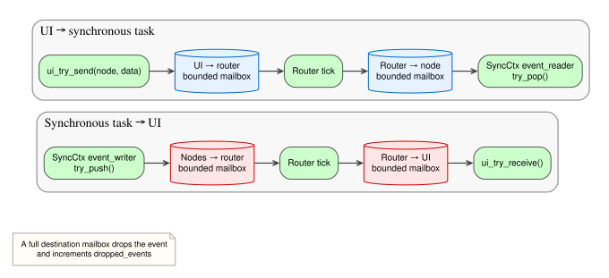
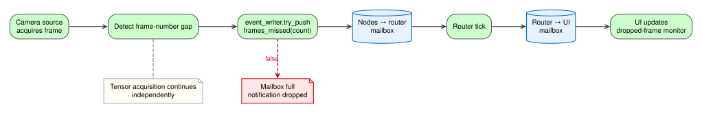
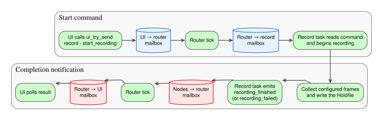

# Events

Holoflow events carry control and status messages independently of tensor data. This page builds on the synchronous execution context introduced in the [Holoflow task model](task-model.md). An event contains a direction, a destination or originating node ID, a JSON payload, and a monotonic timestamp. The router moves events between bounded mailboxes; every send and receive operation is non-blocking, and mailbox counters expose successful and dropped traffic.

Event handles currently belong to `SyncCtx`, so only synchronous tasks can consume or emit events directly. The scheduler binds each synchronous node's reader and writer before execution, while a dedicated router loop calls `tick()` to move queued events between the UI and node mailboxes.

[](../../assets/images/holoflow-event-routing.svg)

*UI commands are routed to a named task; task notifications are routed back to the UI.*

=== "UI to task"

    ```cpp
    // Application thread: enqueue a command for the node named "record".
    const bool queued = scheduler.ui_try_send(
        "record",
        {{"type", "start_recording"}, {"record_path", "capture.holo"}});

    // Record task: drain commands without blocking its execute call.
    while (auto event = ctx.event_reader->try_pop()) {
      if (event->data.at("type") == "start_recording") {
        begin_recording(event->data.at("record_path").get<std::string>());
      }
    }
    ```

=== "Task to UI"

    ```cpp
    // Task: publish a status notification.
    holoflow_event::Event event{
        .direction = holoflow_event::EventDirection::ToUi,
        .node_id   = "camera",
        .data      = {{"type", "frames_missed"}, {"count", missed_frames}},
        .ts        = std::chrono::steady_clock::now(),
    };

    if (!ctx.event_writer->try_push(std::move(event))) {
      logger()->warn("Event mailbox is full; frames_missed was dropped");
    }

    // Application thread: poll notifications without blocking.
    while (auto received = scheduler.ui_try_receive()) {
      handle_notification(*received);
    }
    ```

`try_push(...)` returns `false` when its bounded mailbox is full. Tasks should choose deliberately whether to log, coalesce, count, or otherwise tolerate a dropped notification; they must not assume delivery.

## Camera missed-frame notification

The following lifecycle illustrates how a camera source could report a gap without mixing control metadata into its output tensor. It is an example pattern; current camera sources do not yet emit this event.

[](../../assets/images/holoflow-camera-event-lifecycle.svg)

*Frame acquisition continues while the event router carries the missed-frame notification to the UI.*

## Recording command and completion

The recording path uses both event directions. The UI sends `start_recording` to the node named `record`. The task drains that command during `execute(...)`, records the configured frame count, then emits `recording_finished`; validation or write failures emit `recording_failed` instead.

[](../../assets/images/holoflow-recording-event-lifecycle.svg)

*The start request and completion notification travel through separate bounded mailboxes.*

## Where to go next

- Return to the [Holoflow task model](task-model.md).
- Learn how tasks control buffer lifetimes in [Storage Ownership](storage-ownership.md).
