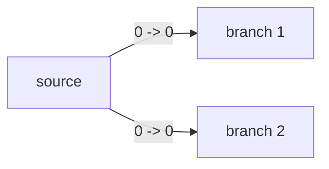
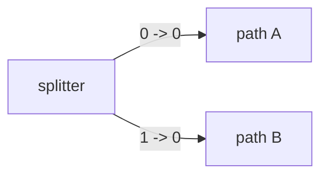

# Graph And Data Model

Holoflow represents a pipeline as a directed graph of tasks. This page focuses on the *source* model: what the user builds before compilation.

## Graph primitives

The graph type is:

```cpp
using GraphSpec = boost::adjacency_list<..., NodeSpec, EdgeSpec>;
```

The public payload types are:

```cpp
struct NodeSpec {
  std::string    name;
  std::string    kind;
  nlohmann::json settings;
  bool           debug = true;
};

struct EdgeSpec {
  int out_idx;
  int in_idx;
};
```

## Mental model

- A node is a configured task instance.
- An edge connects one output slot of the producer to one input slot of the consumer.
- `kind` selects the factory that knows how to validate, create, and update that node.
- `settings` is task-specific JSON carried unchanged into the factory.

## What the compiler currently expects

The current compiler enforces these structural rules:

- node names must be unique
- every node kind must exist in the registry
- each destination input slot may be targeted by at most one edge
- the graph must be acyclic

So the most accurate way to think about `GraphSpec` today is:

> a typed DAG with explicit slot wiring

That is more general than a pure tree and more constrained than an arbitrary multigraph.

## Input and output slots

Edges are labeled by slot indices:

- `out_idx`: which output tensor of the source node is used
- `in_idx`: which input tensor slot of the destination node is filled

This makes multi-output tasks and explicit merge points possible.

### Example: fan-out



One produced tensor may feed multiple downstream consumers.

### Example: multi-output node



## JSON representation

`GraphSpec` supports JSON serialization with `holoflow::core::to_json(...)` and parsing with `holoflow::core::from_json(...)`.

The format is:

```json
{
  "nodes": {
    "src": {
      "type": "Camera",
      "params": {
        "fps": 100
      }
    },
    "fft": {
      "type": "FFT",
      "params": {}
    }
  },
  "edges": [
    {
      "from": "src",
      "to": "fft",
      "out": 0,
      "in": 0
    }
  ]
}
```

Notes:

- node names are the object keys of `nodes`
- `type` maps to `NodeSpec::kind`
- `params` maps to `NodeSpec::settings`
- `debug` is optional and defaults to `true`

## DOT representation

`holoflow::core::to_dot(graph)` renders a Graphviz DOT view of the source graph.

The source DOT is useful when debugging:

- missing or duplicated edges
- unexpected settings payloads
- high-level topology before compilation

## C++ construction example

```cpp
#include <boost/graph/adjacency_list.hpp>
#include <holoflow/core/graph_spec.hh>

holoflow::core::GraphSpec graph;

auto src = boost::add_vertex(holoflow::core::NodeSpec{
    .name = "src",
    .kind = "Source",
    .settings = {{"path", "input.bin"}}
}, graph);

auto proc = boost::add_vertex(holoflow::core::NodeSpec{
    .name = "proc",
    .kind = "Process",
    .settings = {{"gain", 2.0}}
}, graph);

boost::add_edge(src, proc, holoflow::core::EdgeSpec{
    .out_idx = 0,
    .in_idx = 0,
}, graph);
```

## Source graph vs compiled graph

It is useful to keep the distinction sharp:

### Source graph

- names
- kinds
- JSON settings
- slot wiring

### Compiled graph

- inferred tensor descriptors
- tensor IDs
- storage IDs
- execution sections
- streams
- concrete task instances

The source graph is what you intend. The compiled graph is what the runtime can execute.

## Pseudo algorithm: building a graph

```text
create empty GraphSpec
for each logical operation:
  add vertex with:
    - stable name
    - registered kind
    - JSON settings

for each tensor dependency:
  add edge with:
    - producer output index
    - consumer input index
```

## Design guidance

- Keep node names stable across graph updates if you want the compiler to attempt task reuse.
- Use kinds as API identifiers, not display labels.
- Keep settings purely declarative; do not store live resources in them.
- Treat slot indices as part of the node contract and document them in each task factory.
