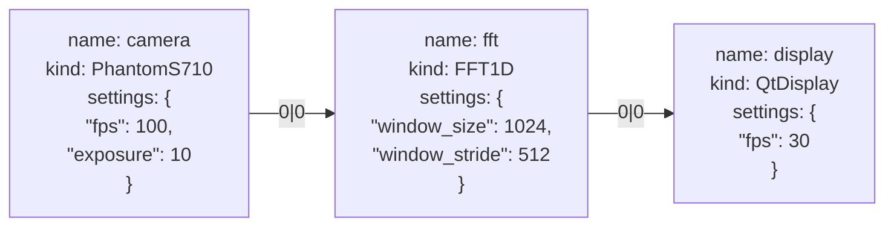
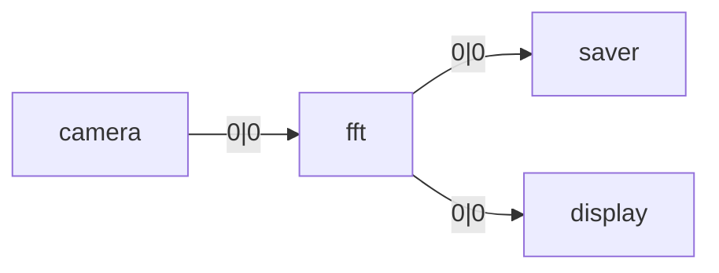
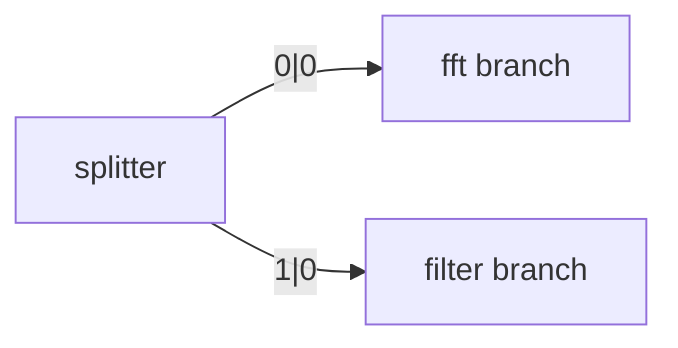
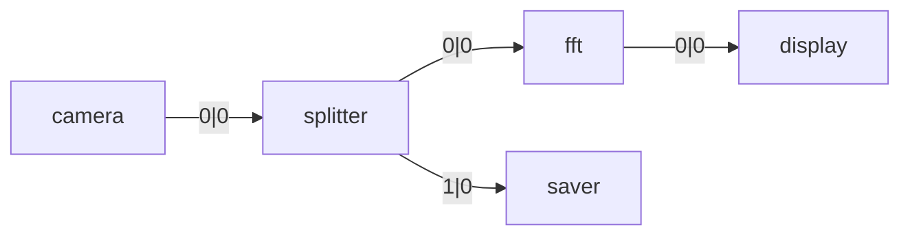

# Graph Model

## Overview

Holoflow represents computational pipelines as **graphs**. This abstraction makes it possible to describe workflows in a clear, declarative way, while giving the runtime the flexibility to manage execution and resources efficiently.

## Graph Structure

Formally, a graph is $G = (V, E)$ where:

* **$V$** is the set of vertices (nodes). In Holoflow, nodes are **computational tasks** (operations).
* **$E$** is the set of edges. In Holoflow, edges describe **data flow** from one node’s output to another node’s input.

Holoflow uses two kinds of graphs:

1. **Graph Specification**: a high-level declarative structure describing the pipeline: which tasks exist, how they are connected, and what parameters they use.
2. **Executable Graph**: a low-level structure produced by the Holoflow compiler. This is the validated, resource-aware graph that the scheduler executes.

### Restrictions

Currently, Holoflow graphs are **tree-structured**:

* There is a single root node.
* Each node has exactly one parent but may produce multiple outputs.
* Each output may connect to one or more children.
* Cycles are not allowed.

This restriction simplifies scheduling and resource management.

---

## Graph Specification

A **node** contains three key fields:

* **name**: a unique identifier for the node in the graph.
* **kind**: the operation type (e.g., FFT, Display, File Reader).
* **settings**: a JSON object describing parameters specific to that operation.

An **edge** connects one output of a parent node to one input of a child node. Edges are labeled by `(parent_output_index,  child_input_index)`.

### Examples

#### Example 1: Linear pipeline (full node details)

A simple chain of tasks.



Here, the camera produces a stream (`output 0`) consumed by the FFT, which in turn produces an output displayed by the GUI.

---

#### Example 2: Branching output

One output feeding multiple children.



The FFT node produces a single result stream that is written to disk (saver) and simultaneously displayed.

---

#### Example 3: Multiple outputs

A node producing different outputs.



The splitter produces two separate streams: one is sent to an FFT, the other to a filter. Each output index has its own consumers.

---

#### Example 4: Mixed case

Combining multiple outputs and multiple children.



The camera feeds a splitter. The splitter has two outputs: one goes to an FFT (then displayed), the other is saved to disk.

---

### Code Example
Here is a simple graph specification in C++ using the Holoflow API:

```cpp
#include <holoflow/core/graph_spec.hh>
#include <nlohmann/json.hpp>

using json = nlohmann::json;
using GraphSpec = holoflow::core::GraphSpec;
using NodeSpec = holoflow::core::NodeSpec;
using EdgeSpec = holoflow::core::EdgeSpec;

GraphSpec create_graph_spec() {
  GraphSpec graph_spec;

  auto camera= boost::add_vertex(NodeSpec{
    .name = "camera",
    .kind = "PhantomS710",
    .settings = json{
      {"fps", 100},
      {"exposure", 10}
    }
  }, graph_spec);

  auto fft = boost::add_vertex(NodeSpec{
    .name = "fft",
    .kind = "FFT1D",
    .settings = json{
      {"window_size", 1024},
      {"window_stride", 512}
    }
  }, graph_spec);

  auto display = boost::add_vertex(NodeSpec{
    .name = "display",
    .kind = "QtDisplay",
    .settings = json{
      {"fps", 30}
    }
  }, graph_spec);

  boost::add_edge(camera, fft, EdgeSpec{
    .out_idx = 0,
    .in_idx = 0,
  }, graph_spec);

  boost::add_edge(fft, display, EdgeSpec{
    .out_idx = 0,
    .in_idx = 0,
  }, graph_spec);

  return graph_spec;
}

```

### GraphSpec utilities & serialization

Holoflow provides helpers to serialize and inspect graph specifications. You
can convert a `GraphSpec` into JSON (and back) and produce Graphviz DOT source
for visualization. The JSON helper accepts `GraphSpecWriteOptions` that let
you control how much detail is emitted (node names, kinds, settings, edge
indices, ...). These utilities are intended for debugging, logging and
persisting pipeline specs.

## Graph Compilation & Execution
### Factories
The link between the graph specification and the actual operations is made through **factories**. A factory is a class that can create instances of a specific task. A registry of factories is an associative map from task kind (string) to factory instance. The user is responsible for populating this registry with all the tasks they want to use in their graphs.

#### Code Example
Here is a simple registry in C++ using the Holoflow API:

```cpp
#include <holoflow/core/registry.hh>

#include "tasks/phantom_s710.hh"
#include "tasks/fft_1d.hh"
#include "tasks/qt_display.hh"

using Registry = holoflow::core::Registry;

Registry create_registry() {
  Registry registry;

  registry.register_sync("PhantomS710", std::make_shared<PhantomS710Factory>());
  registry.register_sync("FFT1D", std::make_shared<FFT1DFactory>());
  registry.register_sync("QtDisplay", std::make_shared<QtDisplayFactory>());

  return registry;
}
```

!!! note
    The "sync" in `register_sync` indicates that these tasks are synchronous. More information about task types can be found in the [Tasks documentation](./tasks.md).

### Compilation

The graph specification, as the name suggests, is only a specification. It holds no behaviour and is declarative only. The Holoflow compiler translates this high-level description into a combination of:

* **Execution resources**: instanciated tasks, allocated memory, etc. Any data used while running the model.
* **Graph Planification**: lower-level representation of the graph, linked to resources, ready for execution. Contains metadata about the nature of each node.
* **Sections**: subgraphs that can be executed concurrently. Contains the topological ordering of nodes and allows pipeline parallelism.

Compiling a graph specification may take a noticeable amount of time, largely due to resource allocation (e.g., GPU memory) and tasks
initialization (e.g., opening camera connections, preparing FFT plans). This is a one-time cost paid before execution. It can be amortized
on updates by reusing the same compiled graph multiple times. Doing so triggers an update instead of a full recompile, which is much 
faster as it skips nodes that have not changed, and may reuse resources for some tasks.

The compilation process also performs validation, ensuring that the graph is well-formed and that all tasks can be executed with the given
settings. Each task is responsible for validating its own settings and exposes metadata about its outputs given those settings and inputs.
This is the signature of a task. The compiler uses these signatures to ensure that connected nodes are compatible. Therefore, a graph
is guaranteed to be semantically valid once compiled.

#### Code Example
Here is a simple compilation in C++ using the Holoflow API:

```cpp
#include <holoflow/runtime/compiler.hh>

using Compiler = holoflow::runtime::Compiler;

void compile_graph() {
  auto graph_spec = create_graph_spec();
  auto registry = create_registry();
  Compiler compiler(registry);

  decltype(compiler.compile(graph_spec)) compiled_graph = nullptr;

  // First-time compilation
  try {
    compiled_graph = compiler.compile(graph_spec);
  } catch (const std::exception& e) {
    std::cerr << "Graph compilation failed: " << e.what() << std::endl;
    return;
  }

  // Subsequent update (if graph_spec has changed)
  auto new_spec = create_graph_spec(); // or modify the existing one
  try {
    compiled_graph = compiler.compile(new_spec, std::move(compiled_graph));
  } catch (const std::exception& e) {
    std::cerr << "Graph update failed: " << e.what() << std::endl;
    return;
  }
}
```
    
### Compiled artifacts (brief)

The compiler produces a `CompilerOutput` containing a low-level `GraphPlan` and
execution artifacts. The `GraphPlan` uses `NodePlan` and `EdgePlan` entries to
carry inference metadata and assigned tensor IDs. The `ExecResouces` object
contains preallocated CUDA streams, instantiated task objects, and allocated
`Tensor` buffers indexed by tensor id. These are then grouped into `Section`
objects used by the scheduler.

The important practical point is that the compiled artifacts include both the
logical plan and the physical resources required to run the pipeline — and you
should keep these alive while the scheduler is executing the graph.

### Execution
The holoflow scheduler is started with those three components and executes the graph accordingly. It is also responsible for runtime
metrics collection. Its API remains very simple, with only three main methods:

* `start()`: starts execution of the graph. (non-blocking)
* `stop()`: stops execution of the graph. (non-blocking)
* `wait()`: blocks until execution is fully stopped.

#### Code Example
Here is a simple execution in C++ using the Holoflow API:

```cpp
#include <holoflow/runtime/graph_exec.hh>
#include <thread>
#include <chrono>

using Scheduler = holoflow::runtime::Scheduler;

int main() {
  auto graph_spec = create_graph_spec();
  auto registry = create_registry();
  Compiler compiler(registry);
  auto compiled_graph = compiler.compile(graph_spec);

  Scheduler scheduler(compiled_graph->graph, compiled_graph->sections, compiled_graph->resources);

  scheduler.start();
  std::this_thread::sleep_for(std::chrono::seconds(10)); // Let it run for 10 seconds
  scheduler.stop();
  scheduler.wait();
}
```

!!! warning
    The GraphPlan, Sections and Resources returned by the compiler must be kept alive while the scheduler is running. Therefore the 
    Scheduler should be recreated if the graph is updated.