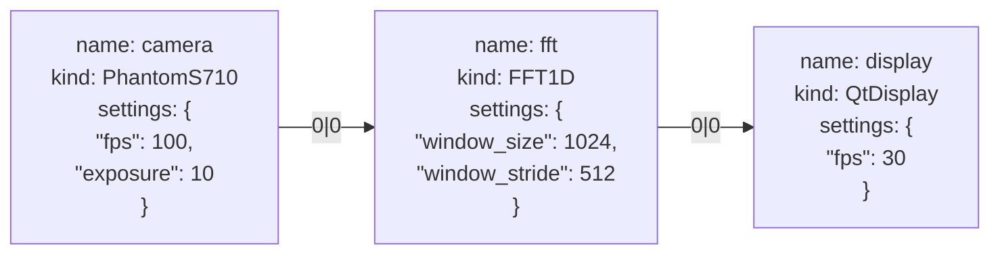
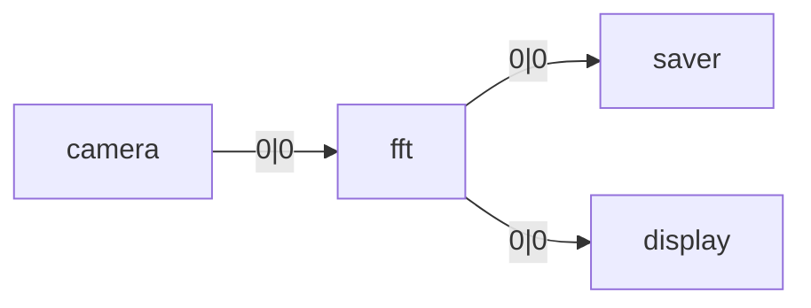
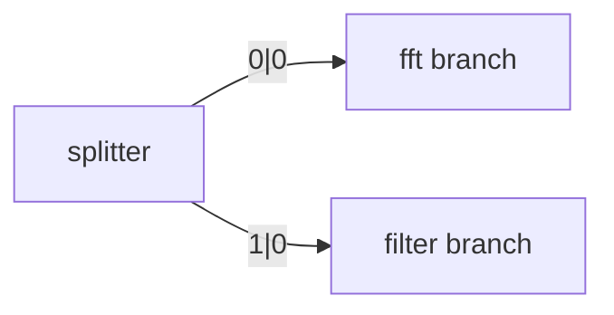
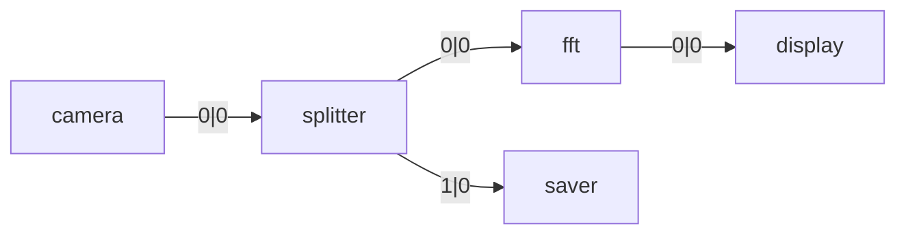

# Graph Model

## Overview

Holoflow represents computational pipelines as **graphs**. This abstraction makes it possible to describe workflows in a clear, declarative way, while giving the runtime the flexibility to manage execution and resources efficiently.

## Graph Structure

Formally, a graph is $G = (V, E)$ where:

* **$V$** is the set of vertices (nodes). In Holoflow, nodes are **computational tasks** (operations).
* **$E$** is the set of edges. In Holoflow, edges describe **data flow** from one node’s output to another node’s input.

Holoflow uses two kinds of graphs:

1. **Graph Specification**: a high-level declarative structure describing the pipeline: which tasks exist, how they are connected, and what parameters they use.
2. **Executable Graph**: a low-level structure produced by the Holoflow compiler. This is the validated, resource-aware graph that the scheduler executes.

### Restrictions

Currently, Holoflow graphs are **tree-structured**:

* There is a single root node.
* Each node has exactly one parent but may produce multiple outputs.
* Each output may connect to one or more children.
* Cycles are not allowed.

This restriction simplifies scheduling and resource management.

---

## Graph Specification

A **node** contains three key fields:

* **name**: a unique identifier for the node in the graph.
* **kind**: the operation type (e.g., FFT, Display, File Reader).
* **settings**: a JSON object describing parameters specific to that operation.

An **edge** connects one output of a parent node to one input of a child node. Edges are labeled by `(parent_output_index,  child_input_index)`.

### Examples

#### Example 1: Linear pipeline (full node details)

A simple chain of tasks.

Here, the camera produces a stream (`output 0`) consumed by the FFT, which in turn produces an output displayed by the GUI.

---

#### Example 2: Branching output

One output feeding multiple children.

The FFT node produces a single result stream that is written to disk (saver) and simultaneously displayed.

---

#### Example 3: Multiple outputs

A node producing different outputs.

The splitter produces two separate streams: one is sent to an FFT, the other to a filter. Each output index has its own consumers.

---

#### Example 4: Mixed case

Combining multiple outputs and multiple children.

The camera feeds a splitter. The splitter has two outputs: one goes to an FFT (then displayed), the other is saved to disk.

---

## Graph Compilation & Execution