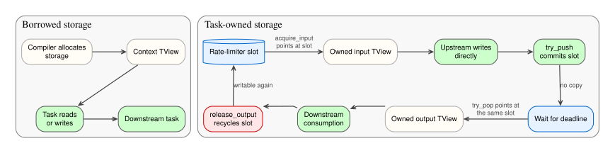

# Storage Ownership

Most tasks use storage allocated by the compiler, but tasks that control buffering or publication can manage their own storage. This page explains both lifecycles and builds on the [Holoflow task model](task-model.md).

## Borrowed and owned storage

Most numerical tasks borrow their input and output storage. The compiler allocates the tensors, the scheduler puts their views in the context, and the task reads or writes those views during its operation. Such tasks keep the default `acquire_input(...)` and `release_output(...)` implementations.

Some tasks must control storage themselves. Their factories mark the relevant slots in `InferResult::owned_inputs` and `InferResult::owned_outputs`, and the tasks implement the corresponding lifecycle hooks.

[](../../assets/images/holoflow-storage-ownership.svg)

*Borrowed tasks use compiler allocations directly; owning tasks publish regions from their own buffers through stable `Storage` objects.*

For owned slots, `IOStorageAccess` exposes the stable storage objects prepared by the compiler:

```cpp
class IOStorageAccess {
public:
  virtual Storage &owned_input_storage(size_t index)  = 0;
  virtual Storage &owned_output_storage(size_t index) = 0;
};
```

## An owning rate limiter

An owning version of the [rate limiter](task-model.md#a-non-owning-asynchronous-task) can expose its one-element staging slot directly to upstream and downstream work instead of copying into and out of a private temporary buffer.

### Owned inputs

Before execution or a push, the scheduler calls `acquire_input(index)`. The task either returns a writable view or `std::nullopt` when no storage is currently available. The scheduler keeps retrying while the result is empty, but stops waiting when cancellation is requested.

The task publishes the selected pointer through the stable `Storage` object returned by `storage_access().owned_input_storage(index)`. Context views already refer to that object, so upstream work writes directly into the rate limiter's slot. `try_push(...)` only commits the filled slot; it does not copy the input.

### Owned outputs

When the deadline is reached, `try_pop(...)` publishes that same slot through the stable output `Storage`. The scheduler calls `release_output(index)` only after the remaining work in the consumer section has finished using it. Until then, `pending_` remains true and `acquire_input(...)` applies backpressure.

The two implementations differ only in where their slot is allocated. Neither task submits a copy or a kernel.

=== "C++ / CPU"

    ```cpp
    class CpuOwnedRateLimiterTask final : public holoflow::core::IAsyncTask {
    public:
      using Clock = std::chrono::steady_clock;

      CpuOwnedRateLimiterTask(holoflow::core::TDesc desc, double max_fps)
          : desc_(std::move(desc)), slot_(desc_.num_bytes()),
            period_(std::chrono::duration_cast<Clock::duration>(
                std::chrono::duration<double>(1.0 / max_fps))),
            next_emit_(Clock::now()) {}

      std::optional<holoflow::core::TView> acquire_input(int index) override {
        if (index != 0) {
          throw std::out_of_range("OwnedRateLimiter: invalid input index");
        }
        if (pending_.load(std::memory_order_acquire)) {
          return std::nullopt;
        }

        auto &storage = storage_access().owned_input_storage(0);
        storage.ptr   = slot_.data();
        return holoflow::core::TView{.desc = desc_, .storage = &storage};
      }

      holoflow::core::OpResult
      try_push(holoflow::core::AsyncPushCtx &ctx) override {
        if (ctx.cancelled->load(std::memory_order_relaxed)) {
          return holoflow::core::OpResult::Cancelled;
        }

        storage_access().owned_input_storage(0).ptr = nullptr;
        pending_.store(true, std::memory_order_release);
        return holoflow::core::OpResult::Ok;
      }

      holoflow::core::OpResult
      try_pop(holoflow::core::AsyncPopCtx &ctx) override {
        if (ctx.cancelled->load(std::memory_order_relaxed)) {
          return holoflow::core::OpResult::Cancelled;
        }

        const auto now = Clock::now();
        if (!pending_.load(std::memory_order_acquire) || now < next_emit_) {
          return holoflow::core::OpResult::NotReady;
        }

        auto &storage = storage_access().owned_output_storage(0);
        storage.ptr   = slot_.data();
        ctx.outputs[0] = holoflow::core::TView{.desc = desc_, .storage = &storage};
        next_emit_     = now + period_;
        return holoflow::core::OpResult::Ok;
      }

      void release_output(int index) override {
        if (index != 0) {
          throw std::out_of_range("OwnedRateLimiter: invalid output index");
        }

        storage_access().owned_output_storage(0).ptr = nullptr;
        pending_.store(false, std::memory_order_release);
      }

    private:
      holoflow::core::TDesc  desc_;
      std::vector<std::byte> slot_;
      Clock::duration        period_;
      Clock::time_point      next_emit_;
      std::atomic<bool>      pending_ = false;
    };
    ```

=== "CUDA / GPU"

    ```cpp
    class CudaOwnedRateLimiterTask final : public holoflow::core::IAsyncTask {
    public:
      using Clock = std::chrono::steady_clock;

      CudaOwnedRateLimiterTask(holoflow::core::TDesc desc, double max_fps)
          : desc_(std::move(desc)),
            slot_(curaii::make_unique_device_ptr<std::byte>(desc_.num_bytes())),
            period_(std::chrono::duration_cast<Clock::duration>(
                std::chrono::duration<double>(1.0 / max_fps))),
            next_emit_(Clock::now()) {}

      std::optional<holoflow::core::TView> acquire_input(int index) override {
        if (index != 0) {
          throw std::out_of_range("OwnedRateLimiter: invalid input index");
        }
        if (pending_.load(std::memory_order_acquire)) {
          return std::nullopt;
        }

        auto &storage = storage_access().owned_input_storage(0);
        storage.ptr   = slot_.get();
        return holoflow::core::TView{.desc = desc_, .storage = &storage};
      }

      holoflow::core::OpResult
      try_push(holoflow::core::AsyncPushCtx &ctx) override {
        if (ctx.cancelled->load(std::memory_order_relaxed)) {
          return holoflow::core::OpResult::Cancelled;
        }

        storage_access().owned_input_storage(0).ptr = nullptr;
        pending_.store(true, std::memory_order_release);
        return holoflow::core::OpResult::Ok;
      }

      holoflow::core::OpResult
      try_pop(holoflow::core::AsyncPopCtx &ctx) override {
        if (ctx.cancelled->load(std::memory_order_relaxed)) {
          return holoflow::core::OpResult::Cancelled;
        }

        const auto now = Clock::now();
        if (!pending_.load(std::memory_order_acquire) || now < next_emit_) {
          return holoflow::core::OpResult::NotReady;
        }

        auto &storage = storage_access().owned_output_storage(0);
        storage.ptr   = slot_.get();
        ctx.outputs[0] = holoflow::core::TView{.desc = desc_, .storage = &storage};
        next_emit_     = now + period_;
        return holoflow::core::OpResult::Ok;
      }

      void release_output(int index) override {
        if (index != 0) {
          throw std::out_of_range("OwnedRateLimiter: invalid output index");
        }

        storage_access().owned_output_storage(0).ptr = nullptr;
        pending_.store(false, std::memory_order_release);
      }

    private:
      holoflow::core::TDesc                 desc_;
      curaii::unique_device_ptr<std::byte> slot_;
      Clock::duration                       period_;
      Clock::time_point                     next_emit_;
      std::atomic<bool>                     pending_ = false;
    };
    ```

Both factories normalize the task-controlled slot to offset zero and mark its input and output as owned:

```cpp
const holoflow::core::TDesc owned_desc(
    input.shape, input.dtype, input.mem_loc);

return holoflow::core::InferResult{
    .input_descs                  = {owned_desc},
    .output_descs                 = {owned_desc},
    .in_place                     = {},
    .owned_inputs                 = {true},
    .owned_outputs                = {true},
    .kind                         = holoflow::core::TaskKind::Async,
    .synchronizes_producer_stream = false,
};
```

The CUDA task deliberately receives no streams. With `synchronizes_producer_stream` set to `false`, the scheduler completes upstream work on the producer stream before `try_push(...)` publishes the slot. The consumer can therefore expose the same device pointer without an internal copy or an additional synchronization.

!!! warning "Ownership is a declared contract"
    Call `acquire_input(...)` and `release_output(...)` only for slots marked as owned by factory inference. Failing to implement the lifecycle for an owned slot, or using the hooks for a borrowed slot, is undefined behavior.

At most one acquired input group and one unreleased output group may exist at a time under the current single-producer, single-consumer assumptions. An acquired input view is valid only through the corresponding execution or push call. An owned output remains valid until its release call.

!!! note "Cancellation and acquired inputs"
    Holoflow does not yet define how to roll back an owned input acquired immediately before cancellation. Task authors should not assume an implicit discard or commit operation exists.

## Where to go next

- Return to the [Holoflow task model](task-model.md).
- Learn how control messages move through [Holoflow events](events.md).
