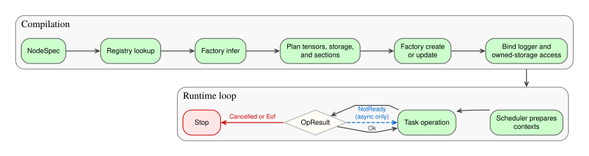
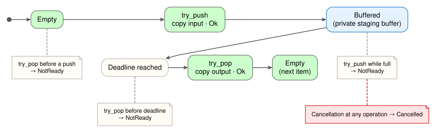

# Holoflow Task Model

Holoflow describes every computation as a task with zero or more tensor inputs and zero or more tensor outputs. A task is either synchronous, completing one input-to-output operation per call, or asynchronous, separating input consumption from output production.
By convention, a task with no inputs is called a source, and a task with no outputs is called a sink, matching flow-theory naming convention.

## Synchronous tasks

A synchronous task behaves like an ordinary operator: one call consumes the current inputs and produces the corresponding outputs. The call is blocking from the scheduler's point of view, although a GPU task may enqueue work on its assigned CUDA stream and return before the device finishes it.

The essential interface is relatively small:

```cpp
class ISyncTask : public ITask {
public:
  [[nodiscard]] virtual OpResult execute(SyncCtx &ctx) = 0;
};

struct SyncCtx {
  std::span<TView>             inputs;
  std::span<TView>             outputs;
  std::atomic<bool>           *cancelled;
  holoflow_event::EventWriter *event_writer;
  holoflow_event::EventReader *event_reader;
};
```

`inputs` and `outputs` are ordered by the slots declared for the node. Each `TView` combines a tensor description with access to its storage. The cancellation flag lets a long-running task stop cooperatively. The [event reader and writer](events.md) let synchronous tasks receive and emit application events without coupling the task to the event router.

The return value describes expected control flow:

| Result | Meaning |
| --- | --- |
| `OpResult::Ok` | The operation completed and its outputs are available. |
| `OpResult::NotReady` | Reserved for asynchronous operations; returning it from `execute(...)` is invalid. |
| `OpResult::Cancelled` | The operation stopped because cancellation was requested. |
| `OpResult::Eof` | The task reached the end of its input stream. |

The scheduler accepts `Ok`, `Cancelled`, or `Eof` from a synchronous task. `NotReady` is only meaningful for an asynchronous operation, where the scheduler can retry. Exceptions are reserved for validation or runtime failures; `OpResult` is not an error-reporting mechanism.

### A simple synchronous task

The following tasks compute the square root of a contiguous `float32` tensor. Their execution code is nearly identical conceptually, but the CUDA implementation stores its assigned stream and enqueues a kernel on that stream.

=== "C++ / CPU"

    ```cpp
    class CpuSqrtTask final : public holoflow::core::ISyncTask {
    public:
      holoflow::core::OpResult execute(holoflow::core::SyncCtx &ctx) override {
        if (ctx.cancelled->load(std::memory_order_relaxed)) {
          return holoflow::core::OpResult::Cancelled;
        }

        auto       *src  = reinterpret_cast<const float *>(ctx.inputs[0].data());
        auto       *dst  = reinterpret_cast<float *>(ctx.outputs[0].data());
        const auto  size = ctx.inputs[0].desc.num_elements();

        for (size_t i = 0; i < size; ++i) {
          dst[i] = std::sqrt(src[i]);
        }

        return holoflow::core::OpResult::Ok;
      }
    };
    ```

=== "CUDA / GPU"

    ```cpp
    __global__ void sqrt_kernel(const float *src, float *dst, size_t size) {
      const size_t index = static_cast<size_t>(blockIdx.x) * blockDim.x + threadIdx.x;
      if (index < size) {
        dst[index] = sqrtf(src[index]);
      }
    }

    class CudaSqrtTask final : public holoflow::core::ISyncTask {
    public:
      explicit CudaSqrtTask(cudaStream_t stream) : stream_(stream) {}

      holoflow::core::OpResult execute(holoflow::core::SyncCtx &ctx) override {
        if (ctx.cancelled->load(std::memory_order_relaxed)) {
          return holoflow::core::OpResult::Cancelled;
        }

        auto       *src  = reinterpret_cast<const float *>(ctx.inputs[0].data());
        auto       *dst  = reinterpret_cast<float *>(ctx.outputs[0].data());
        const auto  size = ctx.inputs[0].desc.num_elements();
        if (size == 0) {
          return holoflow::core::OpResult::Ok;
        }

        constexpr unsigned int block_size = 256;
        const auto grid_size = static_cast<unsigned int>((size + block_size - 1) / block_size);
        sqrt_kernel<<<grid_size, block_size, 0, stream_>>>(src, dst, size);
        CUDA_CHECK(cudaGetLastError());
        return holoflow::core::OpResult::Ok;
      }

    private:
      cudaStream_t stream_;
    };
    ```

The CUDA call is asynchronous with respect to the CPU, but `execute(...)` is still a synchronous-task operation in Holoflow: it submits exactly one input-to-output computation. The scheduler preserves ordering on the section's CUDA stream and performs the required synchronization before publishing work across an ordinary asynchronous boundary.

!!! warning

    A task enqueing CUDA work on a stream should generally not synchronise the stream after. It is the scheduler responsibility to do so. However it remains possible,
    as it may be required for thread safety.

## Task factories

Tasks do not expose a standard public constructor to Holoflow. Instead, the application registers a factory for each task kind. This separates three concerns:

1. `infer(...)` validates settings and input tensor descriptions, then declares the output descriptions and memory semantics.
2. `create(...)` constructs the runtime task with the resources assigned by the compiler.
3. `update(...)` reuses or replaces an existing task when its inputs or settings change.

Inference is shared by both factory kinds:

```cpp
class ITaskFactory {
public:
  virtual InferResult infer(
      std::span<const TDesc> input_descs,
      const nlohmann::json  &settings) const = 0;
};
```

A synchronous factory adds construction and update operations:

```cpp
class ISyncTaskFactory : public ITaskFactory {
public:
  virtual std::unique_ptr<ISyncTask> create(
      std::span<const TDesc> input_descs,
      const nlohmann::json  &settings,
      const SyncCreateCtx   &ctx) const = 0;

  virtual std::unique_ptr<ISyncTask> update(
      std::unique_ptr<ISyncTask> old_task,
      std::span<const TDesc>     input_descs,
      const nlohmann::json      &settings,
      const SyncCreateCtx       &ctx) const;
};
```

`InferResult` is the task's contract with the compiler:

```cpp
struct InferResult {
  std::vector<TDesc>   input_descs;
  std::vector<TDesc>   output_descs;
  std::vector<InPlace> in_place;
  std::vector<bool>    owned_inputs;
  std::vector<bool>    owned_outputs;
  TaskKind             kind;
  bool                 synchronizes_producer_stream = false;
};
```

The tensor descriptions record the validated inputs and inferred outputs. [`in_place`](#in-place-mappings) declares outputs that reuse input storage, while the [ownership masks](storage-ownership.md) identify slots whose memory lifecycle is controlled by the task. `kind` selects synchronous or asynchronous construction.

The final flag applies only to asynchronous tasks. When it is `true`, `try_push(...)` must synchronize its producer stream before returning any result that lets the scheduler advance. With the default value of `false`, the scheduler supplies the required barrier before calling the producer side. Because inference happens before task construction, the compiler can validate the whole graph and plan its memory and execution sections without running a task.

`SyncCreateCtx` supplies the CUDA stream assigned to the execution section. The asynchronous equivalent, `AsyncCreateCtx`, supplies separate producer and consumer streams. The default `update(...)` implementation discards the old task and calls `create(...)`; a factory only needs to override it when preserving allocations or other internal state is worthwhile.

### Factories for the square-root tasks

Each factory below accepts one contiguous `float32` input and rejects the wrong memory location during inference. The output has the same shape, data type, and memory location as the input. Neither implementation owns its storage or operates in place.

=== "C++ / CPU"

    ```cpp
    class CpuSqrtTaskFactory final : public holoflow::core::ISyncTaskFactory {
    public:
      holoflow::core::InferResult
      infer(std::span<const holoflow::core::TDesc> input_descs,
            const nlohmann::json &) const override {
        if (input_descs.size() != 1) {
          throw std::invalid_argument("CpuSqrt expects exactly one input");
        }

        const auto &input = input_descs[0];
        const holoflow::core::TDesc contiguous(
            input.shape, input.dtype, input.mem_loc, input.offset);
        if (input.dtype != holoflow::core::DType::F32 ||
            input.mem_loc != holoflow::core::MemLoc::Host ||
            input.strides != contiguous.strides) {
          throw std::invalid_argument(
              "CpuSqrt expects a contiguous Host float32 tensor");
        }

        return holoflow::core::InferResult{
            .input_descs   = {input},
            .output_descs  = {holoflow::core::TDesc(
                input.shape, input.dtype, input.mem_loc)},
            .in_place      = {},
            .owned_inputs  = {false},
            .owned_outputs = {false},
            .kind          = holoflow::core::TaskKind::Sync,
        };
      }

      std::unique_ptr<holoflow::core::ISyncTask>
      create(std::span<const holoflow::core::TDesc> input_descs,
             const nlohmann::json                  &settings,
             const holoflow::core::SyncCreateCtx   &) const override {
        (void)infer(input_descs, settings);
        return std::make_unique<CpuSqrtTask>();
      }
    };
    ```

=== "CUDA / GPU"

    ```cpp
    class CudaSqrtTaskFactory final : public holoflow::core::ISyncTaskFactory {
    public:
      holoflow::core::InferResult
      infer(std::span<const holoflow::core::TDesc> input_descs,
            const nlohmann::json &) const override {
        if (input_descs.size() != 1) {
          throw std::invalid_argument("CudaSqrt expects exactly one input");
        }

        const auto &input = input_descs[0];
        const holoflow::core::TDesc contiguous(
            input.shape, input.dtype, input.mem_loc, input.offset);
        if (input.dtype != holoflow::core::DType::F32 ||
            input.mem_loc != holoflow::core::MemLoc::Device ||
            input.strides != contiguous.strides) {
          throw std::invalid_argument(
              "CudaSqrt expects a contiguous Device float32 tensor");
        }

        return holoflow::core::InferResult{
            .input_descs   = {input},
            .output_descs  = {holoflow::core::TDesc(
                input.shape, input.dtype, input.mem_loc)},
            .in_place      = {},
            .owned_inputs  = {false},
            .owned_outputs = {false},
            .kind          = holoflow::core::TaskKind::Sync,
        };
      }

      std::unique_ptr<holoflow::core::ISyncTask>
      create(std::span<const holoflow::core::TDesc> input_descs,
             const nlohmann::json                  &settings,
             const holoflow::core::SyncCreateCtx   &ctx) const override {
        (void)infer(input_descs, settings);
        return std::make_unique<CudaSqrtTask>(ctx.stream);
      }
    };
    ```

The registry stores factories rather than task instances:

```cpp
holoflow::core::Registry registry;
registry.register_sync("SqrtCpu", std::make_unique<CpuSqrtTaskFactory>());
registry.register_sync("SqrtCuda", std::make_unique<CudaSqrtTaskFactory>());
registry.register_async("RateLimiterCpu", std::make_unique<CpuRateLimiterFactory>());
registry.register_async("RateLimiterCuda", std::make_unique<CudaRateLimiterFactory>());
```

When a graph node names one of these task kinds, the compiler looks up the corresponding factory, infers its contract, and creates the appropriate runtime task.

!!! note "One task kind in production"
    The two square-root kinds make the CPU and CUDA implementations easy to compare. In an application, a single `Sqrt` factory would typically accept both memory locations during inference, then inspect the inferred input location in `create(...)` and construct the matching implementation.

### From specification to execution

Compilation separates graph validation and resource planning from task execution. The scheduler only receives tasks after the compiler has inferred their tensor contracts, assigned resources, constructed or updated them, and injected their runtime services.

[](../../assets/images/holoflow-task-lifecycle.svg)

*Factories prepare tasks during compilation; the scheduler invokes the resulting task instances at runtime.*

## Asynchronous tasks

An asynchronous task separates input consumption from output production. Its producer side accepts data through `try_push(...)`; its consumer side exposes data through `try_pop(...)`.

```cpp
class IAsyncTask : public ITask {
public:
  [[nodiscard]] virtual OpResult try_push(AsyncPushCtx &ctx) = 0;
  [[nodiscard]] virtual OpResult try_pop(AsyncPopCtx &ctx)   = 0;
};

struct AsyncPushCtx {
  std::span<TView>   inputs;
  std::atomic<bool> *cancelled;
};

struct AsyncPopCtx {
  std::span<TView>   outputs;
  std::atomic<bool> *cancelled;
};
```

The two calls are independent. A successful push does not imply that a pop will immediately succeed, and `try_pop(...)` may return `NotReady` until enough data has accumulated. `try_push(...)` may likewise return `NotReady` when the task cannot accept another input. The scheduler retries either operation until it succeeds, reaches end of stream, is cancelled, or throws an exception.


### A non-owning asynchronous task

Consider a pass-through rate limiter with a one-element staging buffer. Its producer and consumer sides may run on different threads. `try_push(...)` applies backpressure while an element is buffered, so the task never drops an input. `try_pop(...)` withholds that element until its deadline.

[](../../assets/images/holoflow-rate-limiter-lifecycle.svg)

*Push fills one private slot; pop releases it only after the rate-limit deadline.*

```cpp
struct RateLimiterSettings {
  double max_fps;
};
```


=== "C++ / CPU"

    ```cpp
    class CpuRateLimiterTask final : public holoflow::core::IAsyncTask {
    public:
      using Clock = std::chrono::steady_clock;

      CpuRateLimiterTask(const holoflow::core::TDesc &desc, double max_fps)
          : temp_(desc.num_bytes()),
            period_(std::chrono::duration_cast<Clock::duration>(
                std::chrono::duration<double>(1.0 / max_fps))),
            next_emit_(Clock::now()) {}

      holoflow::core::OpResult
      try_push(holoflow::core::AsyncPushCtx &ctx) override {
        if (ctx.cancelled->load(std::memory_order_relaxed)) {
          return holoflow::core::OpResult::Cancelled;
        }
        if (pending_.load(std::memory_order_acquire)) {
          return holoflow::core::OpResult::NotReady;
        }

        std::memcpy(temp_.data(), ctx.inputs[0].data(), temp_.size());
        pending_.store(true, std::memory_order_release);
        return holoflow::core::OpResult::Ok;
      }

      holoflow::core::OpResult
      try_pop(holoflow::core::AsyncPopCtx &ctx) override {
        if (ctx.cancelled->load(std::memory_order_relaxed)) {
          return holoflow::core::OpResult::Cancelled;
        }

        const auto now = Clock::now();
        if (!pending_.load(std::memory_order_acquire) || now < next_emit_) {
          return holoflow::core::OpResult::NotReady;
        }

        std::memcpy(ctx.outputs[0].data(), temp_.data(), temp_.size());
        next_emit_ = now + period_;
        pending_.store(false, std::memory_order_release);
        return holoflow::core::OpResult::Ok;
      }

    private:
      std::vector<std::byte>  temp_;
      Clock::duration         period_;
      Clock::time_point       next_emit_;
      std::atomic<bool>       pending_ = false;
    };
    ```

=== "CUDA / GPU"

    ```cpp
    class CudaRateLimiterTask final : public holoflow::core::IAsyncTask {
    public:
      using Clock = std::chrono::steady_clock;

      CudaRateLimiterTask(const holoflow::core::TDesc &desc, double max_fps,
                          cudaStream_t producer_stream, cudaStream_t consumer_stream)
          : temp_(curaii::make_unique_device_ptr<std::byte>(desc.num_bytes())),
            bytes_(desc.num_bytes()),
            period_(std::chrono::duration_cast<Clock::duration>(
                std::chrono::duration<double>(1.0 / max_fps))),
            next_emit_(Clock::now()), producer_stream_(producer_stream),
            consumer_stream_(consumer_stream) {}

      holoflow::core::OpResult
      try_push(holoflow::core::AsyncPushCtx &ctx) override {
        if (ctx.cancelled->load(std::memory_order_relaxed)) {
          return holoflow::core::OpResult::Cancelled;
        }
        if (pending_.load(std::memory_order_acquire)) {
          return holoflow::core::OpResult::NotReady;
        }

        CUDA_CHECK(cudaMemcpyAsync(temp_.get(), ctx.inputs[0].data(), bytes_,
                                   cudaMemcpyDeviceToDevice, producer_stream_));
        CUDA_CHECK(cudaStreamSynchronize(producer_stream_));
        pending_.store(true, std::memory_order_release);
        return holoflow::core::OpResult::Ok;
      }

      holoflow::core::OpResult
      try_pop(holoflow::core::AsyncPopCtx &ctx) override {
        if (ctx.cancelled->load(std::memory_order_relaxed)) {
          return holoflow::core::OpResult::Cancelled;
        }

        const auto now = Clock::now();
        if (!pending_.load(std::memory_order_acquire) || now < next_emit_) {
          return holoflow::core::OpResult::NotReady;
        }

        CUDA_CHECK(cudaMemcpyAsync(ctx.outputs[0].data(), temp_.get(), bytes_,
                                   cudaMemcpyDeviceToDevice, consumer_stream_));
        CUDA_CHECK(cudaStreamSynchronize(consumer_stream_));
        next_emit_ = now + period_;
        pending_.store(false, std::memory_order_release);
        return holoflow::core::OpResult::Ok;
      }

    private:
      curaii::unique_device_ptr<std::byte> temp_;
      size_t                               bytes_;
      Clock::duration                      period_;
      Clock::time_point                    next_emit_;
      cudaStream_t                         producer_stream_;
      cudaStream_t                         consumer_stream_;
      std::atomic<bool>                    pending_ = false;
    };
    ```

!!! note

    The CUDA implementation synchronizes each copy before publishing a state change. This makes the example's cross-stream buffer safe.

### Rate-limiter factories

`CpuRateLimiterFactory` and `CudaRateLimiterFactory` validate one contiguous input and a positive `max_fps`. The CPU factory accepts only Host memory; the CUDA factory accepts only Device memory and passes both streams from `AsyncCreateCtx` to its task. Both factories declare the same non-owning tensor contract:

```cpp
return holoflow::core::InferResult{
    .input_descs                  = {input},
    .output_descs                 = {holoflow::core::TDesc(
        input.shape, input.dtype, input.mem_loc)},
    .in_place                     = {},
    .owned_inputs                 = {false},
    .owned_outputs                = {false},
    .kind                         = holoflow::core::TaskKind::Async,
    // Use true in CudaRateLimiterFactory and false in CpuRateLimiterFactory.
    .synchronizes_producer_stream = false,
};
```

For the CPU factory, `create(...)` ignores the stream context and constructs `CpuRateLimiterTask`. For the CUDA factory, it forwards `ctx.producer_stream` and `ctx.consumer_stream` to `CudaRateLimiterTask`.

!!! note "One task kind in production"
    As with the square-root example, the separate `RateLimiterCpu` and `RateLimiterCuda` kinds make the implementations easy to compare. An application can expose one `RateLimiter` factory that selects the implementation from the inferred input memory location.

The rate limiter demonstrates asynchronous control flow. The [storage ownership guide](storage-ownership.md#an-owning-rate-limiter) revisits the same task with a task-owned slot, eliminating both copies while preserving its rate-limiting behavior. Because the producer and consumer sides may run in different execution sections, they may be called from different CPU threads and use different CUDA streams.

!!! warning

    Asynchronous tasks must guarantee safe operations under single producer single consumer concurency.

An asynchronous boundary gives the compiler an opportunity to split the graph into independently scheduled sections. In the [queued band-pass example](../index.md#example-2-overlap-work-with-batchqueue), this lets upload, computation, and download overlap across consecutive frames.

## The common task interface

`ISyncTask` and `IAsyncTask` both derive from `ITask`. The base interface provides runtime services shared by the two execution models:

```cpp
class ITask {
public:
  virtual ~ITask() = default;

  [[nodiscard]] virtual std::optional<TView> acquire_input(int index);
  virtual void release_output(int index);

  void bind_logger(std::shared_ptr<spdlog::logger> logger);
  void bind_storage_access(IOStorageAccess *storage_access);

protected:
  spdlog::logger *logger();
  IOStorageAccess &storage_access();
};
```

The compiler binds the logger after constructing every task. It binds [storage access](storage-ownership.md) when factory inference declares at least one owned slot. Consequently, a task must not call `logger()` or `storage_access()` from its constructor. `logger()` is available after compilation during normal runtime methods. `storage_access()` is available in those methods only to tasks whose inference result requires it.

The task-specific logger includes the node kind and name, which keeps messages attributable when several instances of the same implementation appear in a graph. Cancellation is provided separately through each execution context because it belongs to the current scheduler run.

## Choosing a task model

Use a synchronous task when one invocation naturally maps the current inputs to the current outputs. This includes most CPU functions, CUDA kernels, transfers, sources that produce one item per call, and sinks that consume one item per call.

Use an asynchronous task when input acceptance and output availability must progress independently. Queues, batching, windowing, rate conversion, and buffering between independently scheduled sections are the common cases. Asynchronous tasks require more state and stricter ownership reasoning, so they should represent a real scheduling boundary rather than merely a long-running computation.

## In-place mappings

An in-place mapping tells the compiler that an output reuses an input's storage. The task still borrows that storage: it neither allocates it nor participates in the owned-input or owned-output lifecycle.

For example, a square-root factory can declare that output 0 aliases input 0 when its implementation supports `src == dst`:

```cpp
return holoflow::core::InferResult{
    .input_descs   = {input},
    .output_descs  = {input},
    .in_place      = {{.in_idx = 0, .out_idx = 0}},
    .owned_inputs  = {false},
    .owned_outputs = {false},
    .kind          = holoflow::core::TaskKind::Sync,
};
```

During storage planning, the compiler assigns the input and output tensor IDs the same storage ID. Consequently, `ctx.inputs[0]` and `ctx.outputs[0]` describe distinct logical tensors backed by the same allocation.

| Mechanism | Allocation | Pointer publication | Purpose |
| --- | --- | --- | --- |
| In-place mapping | Compiler-managed | Fixed by the compiler | Reuse an input allocation for an output. |
| [Owned storage](storage-ownership.md) | Task-managed | Changed through `IOStorageAccess` | Let a task control when its storage is writable or readable. |

!!! warning "In-place safety is the factory's responsibility"
    Declare a mapping only when the operation is correct with aliased input and output, the output descriptor fits the input allocation, and overwriting the input cannot affect another live consumer. The compiler assigns the shared storage but does not prove these conditions.

## Where to go next

- Learn how tasks control buffer lifetimes in [Storage Ownership](storage-ownership.md).
- Learn how control and status messages move through [Events](events.md).
- Return to the [Holoflow overview](../index.md) to see synchronous tasks and asynchronous queues in complete graphs.
- Follow the planned [LDH pipeline tutorial](../tutorials/ldh-pipeline.md) for an application-level example.
- Browse the existing [Holovibes task reference](../../reference/index.md) for concrete task implementations.
