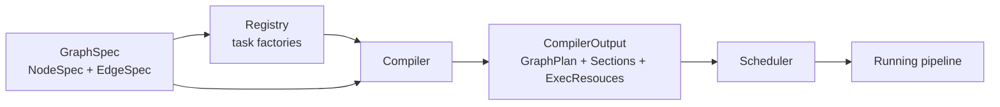

# Holoflow

`holoflow` is the execution core of the repository. It provides:

- A declarative graph model (`holoflow::core::GraphSpec`)
- A task abstraction for synchronous and asynchronous operators
- A compiler that turns a graph specification into an executable plan
- A runtime scheduler that executes that plan on CPU/GPU resources
- Utilities to serialize, inspect, and visualize both the source graph and the compiled graph

At a high level, the library separates four concerns:

1. `core`: static descriptions such as tensor metadata, task interfaces, the registry, and graph specs.
2. `runtime`: compilation, resource allocation, section partitioning, task instantiation, and scheduling.
3. User code: concrete task factories and task implementations.
4. Integration code: the application that assembles a registry, builds a graph, compiles it, and runs it.



## Public API map

The public headers in `src/holoflow/include/holoflow/` group naturally into six topics:

- `core/tensor.hh`: tensor descriptors, storage, tensor views, owning tensors
- `core/tasks.hh`: task interfaces, execution contexts, inference contracts
- `core/registry.hh`: registration and lookup of task factories
- `core/graph_spec.hh`: declarative graph representation and JSON/DOT helpers
- `runtime/compiler.hh`: compilation entry point and compiler output
- `runtime/graph_exec.hh`: executable graph structures, resources, sections, scheduler
- `runtime/graph_display.hh`: DOT export for compiled graphs

## Execution model in one paragraph

You describe a pipeline as a directed acyclic graph whose nodes are task instances and whose edges connect output slots to input slots. The compiler walks that graph in topological order, asks each registered factory to infer its I/O contract, assigns tensor IDs and storage IDs, allocates or reuses memory blocks, partitions the graph into runtime sections, instantiates tasks, and returns a `CompilerOutput`. The scheduler then runs one thread per section plus one router thread, executes synchronous nodes inline, bridges asynchronous nodes across sections, and exposes runtime metrics and UI event channels.

## What this manual covers

- [Architecture](architecture.md): the main runtime objects and how they fit together
- [Graph And Data Model](concepts/graph.md): graph rules, JSON format, tensors, and IDs
- [Task Model](concepts/tasks.md): sync vs async tasks, ownership, in-place execution
- [Tensors And Storage](concepts/tensors.md): the low-level tensor and storage layer
- [Compiler](runtime/compiler.md): passes, update semantics, memory reuse, sectioning
- [Scheduler](runtime/scheduler.md): execution loop, cancellation, metrics, UI events
- [Authoring Tasks](guides/authoring.md): how to implement factories and operators correctly
- [Inspection And Debugging](guides/inspection.md): DOT dumps, tracing, and practical debugging

## Minimal integration flow

```cpp
#include <holoflow/core/graph_spec.hh>
#include <holoflow/core/registry.hh>
#include <holoflow/runtime/compiler.hh>
#include <holoflow/runtime/graph_exec.hh>

holoflow::core::Registry registry = build_registry();
holoflow::core::GraphSpec graph = build_graph();

holoflow::runtime::Compiler compiler(registry);
auto compiled = compiler.compile(graph);

holoflow::runtime::Scheduler scheduler(
    compiled->graph,
    compiled->sections,
    compiled->resources);

scheduler.start();
/* application loop */
scheduler.request_stop();
scheduler.wait();
```

## Important lifetime rule

`Scheduler` does not own the compiled artifacts. It keeps references to `CompilerOutput::graph`, `CompilerOutput::sections`, and `CompilerOutput::resources`. That means the `CompilerOutput` instance must stay alive for the full lifetime of the scheduler.
