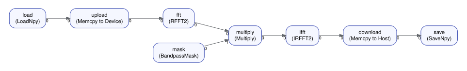
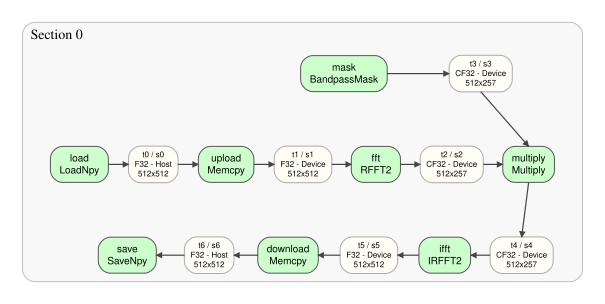
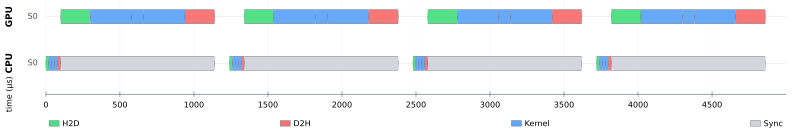
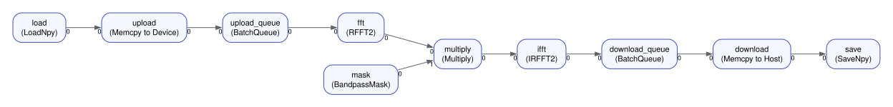
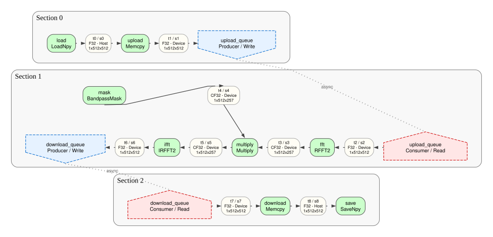
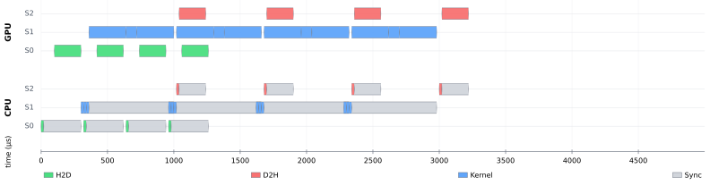

# Holoflow

## What is Holoflow?

Holoflow is a C++/CUDA library for building high-throughput scientific processing pipelines. An application describes its computation as a graph
whose nodes are computational tasks and edges tensor-dependencies between them.

The library separates the description of a pipeline from its execution. A `GraphSpec` records what should run ("the equations"), the compiler validates that graph and prepares its tensors, resources, and tasks. Finally, the scheduler executes the compiled graph on CPU and GPU resources.

Applications provide the concrete tasks. Holoflow provides the graph model, compilation, memory management, scheduling, and inspection tools needed to connect those tasks into a running pipeline.

## Why Holoflow?

Scientific imaging pipelines combine high data rates, intense numerical processing, and algorithms that change quickly as experiments evolve. Implementing every pipeline directly
with manual buffer management and scheduling makes those changes difficult to implement on the long run, and requires substantial high-performance-computing expertise.

Many scientists use NumPy[^numpy2020] or GPU-accelerated alternatives such as CuPy,[^cupy2017] JAX,[^jax2018] and PyTorch[^pytorch2019] because they hide implementation details and keep the code close to the underlying equations. However, a focused benchmark of a representative micro-batch laser Doppler holography pipeline found that an optimized C++/CUDA implementation was up to 74–267% faster than the Python-based implementations, depending on the platform.[^guillou2027]

Holoflow aims to combine those two needs: a high-level, declarative description of the computation and predictable execution suitable for real-time workloads, with first class support for Windows.

## Example 1: Band-pass filter

The following pipeline streams a NumPy array containing $131072$ $512 \times 512$ frames, transfers them to the GPU, applies a frequency-domain band-pass filter, and saves the result.

### Build the graph

Each node has a unique name, a registered task kind, and task-specific JSON settings. Each edge identifies the producer's output slot and the consumer's input slot.

```cpp
#include <boost/graph/adjacency_list.hpp>
#include <holoflow/core/graph_spec.hh>

using holoflow::core::EdgeSpec;
using holoflow::core::GraphSpec;
using holoflow::core::NodeSpec;

GraphSpec graph;

auto load     = boost::add_vertex(NodeSpec{"load", "LoadNpy", {{"path", "input.npy"}}}, graph);
auto upload   = boost::add_vertex(NodeSpec{"upload", "Memcpy", {{"target", "Device"}}}, graph);
auto fft      = boost::add_vertex(NodeSpec{"fft", "RFFT2", {{"axes", {-2, -1}}}}, graph);
auto mask     = boost::add_vertex(NodeSpec{"mask", "BandpassMask",{{"shape", {1, 512, 257}}, {"inner_radius", 0.05}, {"outer_radius", 0.25}}}, graph);
auto multiply = boost::add_vertex(NodeSpec{"multiply", "Multiply", nlohmann::json::object()}, graph);
auto ifft     = boost::add_vertex(NodeSpec{"ifft", "IRFFT2", {{"axes", {-2, -1}}}}, graph);
auto download = boost::add_vertex(NodeSpec{"download", "Memcpy", {{"target", "Host"}}}, graph);
auto save     = boost::add_vertex(NodeSpec{"save", "SaveNpy", {{"path", "filtered.npy"}}}, graph);

boost::add_edge(load, upload, EdgeSpec{0, 0}, graph);
boost::add_edge(upload, fft, EdgeSpec{0, 0}, graph);
boost::add_edge(fft, multiply, EdgeSpec{0, 0}, graph);
boost::add_edge(mask, multiply, EdgeSpec{0, 1}, graph);
boost::add_edge(multiply, ifft, EdgeSpec{0, 0}, graph);
boost::add_edge(ifft, download, EdgeSpec{0, 0}, graph);
boost::add_edge(download, save, EdgeSpec{0, 0}, graph);
```

[](../assets/images/holoflow-bandpass-spec.svg)

*The graph specification describes task configuration and slot-to-slot dependencies.*

### Compile the graph

The registry connects each task kind to the factory that can infer its tensor contract and create its runtime implementation. The `my_app` factories below are illustrative application-provided implementations; the remaining factories come from Holotask and Holonp. Once the application has registered those factories, the compiler turns the specification into an executable graph.

```cpp
#include <memory>

#include <holoflow/core/registry.hh>
#include <holoflow/runtime/compiler.hh>

#include "my_app/sinks/save_npy.hh"
#include "my_app/sources/bandpass_mask.hh"
#include "my_app/sources/load_npy.hh"
#include "my_app/syncs/irfft2.hh"
#include "my_app/syncs/memcpy.hh"
#include "my_app/syncs/multiply.hh"
#include "my_app/syncs/rfft2.hh"

holoflow::core::Registry registry;
registry.register_sync("LoadNpy", std::make_unique<my_app::LoadNpyFactory>());
registry.register_sync("Memcpy", std::make_unique<my_app::syncs::MemcpyFactory>());
registry.register_sync("RFFT2", std::make_unique<my_app::RFFT2Factory>());
registry.register_sync("BandpassMask", std::make_unique<my_app::BandpassMaskFactory>());
registry.register_sync("Multiply", std::make_unique<my_app::MultiplyFactory>());
registry.register_sync("IRFFT2", std::make_unique<my_app::IRFFT2Factory>());
registry.register_sync("SaveNpy", std::make_unique<my_app::SaveNpyFactory>());

holoflow::runtime::Compiler compiler(registry);
auto compiled = compiler.compile(graph);
```

[](../assets/images/holoflow-bandpass-compiled.svg)

*The compiled graph includes inferred tensor types and memory locations and groups the tasks into an execution section.*

### Start and stop the graph

Construct a scheduler from the compiled graph and start it. `start()` returns after launching the runtime threads, so the application can continue with its own event or monitoring loop.

```cpp
#include <holoflow/runtime/graph_exec.hh>

holoflow::runtime::Scheduler scheduler(
    compiled->graph,
    compiled->sections,
    compiled->resources);

scheduler.start();

// Application work continues here.

scheduler.request_stop();
scheduler.wait();
```

`request_stop()` asks the tasks to stop cooperatively. `wait()` joins the runtime threads and is the synchronization point for a clean shutdown. Because the scheduler borrows the compiled graph and resources, keep `compiled` alive until after `scheduler.wait()` returns.

### CPU and GPU timeline

For this graph, the compiler creates one execution section with one CPU thread and one CUDA stream. The scheduler executes the tasks in graph order for each frame.

!!! warning "Synthetic profiling data"
    This timeline uses illustrative timings and is not a performance measurement. It will be replaced with a trace captured from this example.

[](../assets/images/holoflow-bandpass-timeline.svg)

*One section serializes transfers and kernels on a single CUDA stream.*


## Example 2: overlap work with BatchQueue

The initial design is inefficient because computations are halted when the data is transfered between the CPU and GPU. To increase throughput,
we want to overlap computation of `frame (N)` with H2D transfer of `frame (N+1)` and D2H transfer of `frame (N-1)`.

### Updating the graph

Let's add a `BatchQueue` after the first `Memcpy` and another before the second one. Each queue is an asynchronous boundary: the compiler splits the graph at that boundary and assigns each resulting section its own CPU thread and CUDA stream.

The rest of the first graph remains unchanged. Include and register the asynchronous queue factory, then replace the direct `upload -> fft` and `ifft -> download` edges with these nodes and edges:

```cpp
#include "my_app/asyncs/batch_queue.hh"

registry.register_async("BatchQueue", std::make_unique<my_app::asyncs::BatchQueueFactory>());

auto upload_queue   = boost::add_vertex(NodeSpec{"upload_queue", "BatchQueue", {{"target_capacity", 4}, {"output_size", 1}, {"output_stride", 1}}}, graph);
auto download_queue = boost::add_vertex(NodeSpec{"download_queue", "BatchQueue", {{"target_capacity", 4}, {"output_size", 1}, {"output_stride", 1}}}, graph);

boost::add_edge(upload, upload_queue, EdgeSpec{0, 0}, graph);
boost::add_edge(upload_queue, fft, EdgeSpec{0, 0}, graph);
boost::add_edge(ifft, download_queue, EdgeSpec{0, 0}, graph);
boost::add_edge(download_queue, download, EdgeSpec{0, 0}, graph);
```

[](../assets/images/holoflow-bandpass-queued-spec.svg)

*The two `BatchQueue` nodes separate data production from consumption without changing the tensor memory location.*

Apart from registering the asynchronous queue factory, the compiler and scheduler code is identical to the first example. Compiling the modified graph produces three execution sections connected by asynchronous queues.

[](../assets/images/holoflow-bandpass-queued-compiled.svg)

*Each section has its own CPU thread and CUDA stream. The producer and consumer halves of each asynchronous queue connect adjacent sections.*

### Overlapped CPU and GPU timeline

Once the queues contain data, one section can upload the next frame while another applies the filter and the third downloads the previous result. The middle computation remains ordered on its own stream, but independent work from the other sections can overlap it.

!!! warning "Synthetic profiling data"
    This timeline uses illustrative timings and is not a performance measurement. It will be replaced with a trace captured from this example.

[](../assets/images/holoflow-bandpass-queued-timeline.svg)

*Three streams overlap upload, computation, and download work across consecutive frames.*

### Throughput

!!! warning "Measurements pending"
    Throughput values remain `TBD` until both versions have been measured with the same input, hardware, warm-up period, and measurement window.

| Variant | Batch queues | Execution sections / CUDA streams | Measured throughput (frames/s) | Relative throughput |
| --- | ---: | ---: | ---: | ---: |
| Single section | 0 | 1 / 1 | TBD | TBD |
| Three sections | 2 | 3 / 3 | TBD | TBD |

[^numpy2020]: C. R. Harris, J. Millman, S. J. van der Walt, et al., “[Array programming with NumPy](https://doi.org/10.1038/s41586-020-2649-2),” *Nature*, vol. 585, no. 7825, pp. 357–362, 2020. See also the [site-wide reference](../references.md#harris-2020).

[^cupy2017]: R. Okuta, Y. Unno, D. Nishino, S. Hido, and C. Loomis, “[CuPy: A NumPy-Compatible Library for NVIDIA GPU Calculations](https://github.com/cupy/cupy#reference),” in *Proceedings of the Workshop on Machine Learning Systems at NIPS 2017*, 2017. See also the [site-wide reference](../references.md#okuta-2017).

[^jax2018]: J. Bradbury, R. Frostig, P. Hawkins, et al., “[JAX: composable transformations of Python+NumPy programs](https://github.com/jax-ml/jax#citing-jax),” software, 2018. See also the [site-wide reference](../references.md#bradbury-2018).

[^pytorch2019]: A. Paszke, S. Gross, F. Massa, et al., “[PyTorch: An Imperative Style, High-Performance Deep Learning Library](https://papers.neurips.cc/paper_files/paper/2019/hash/bdbca288fee7f92f2bfa9f7012727740-Abstract.html),” in *Advances in Neural Information Processing Systems 32*, pp. 8024–8035, 2019. See also the [site-wide reference](../references.md#paszke-2019).

[^guillou2027]: J. Guillou, J. Fabrizio, E. Carlinet, and M. Atlan, “Real-Time Scientific Computing in Python: The Cost of High-Level GPU Abstractions,” unpublished manuscript, 2027. See also the [site-wide reference](../references.md#guillou-2027).
