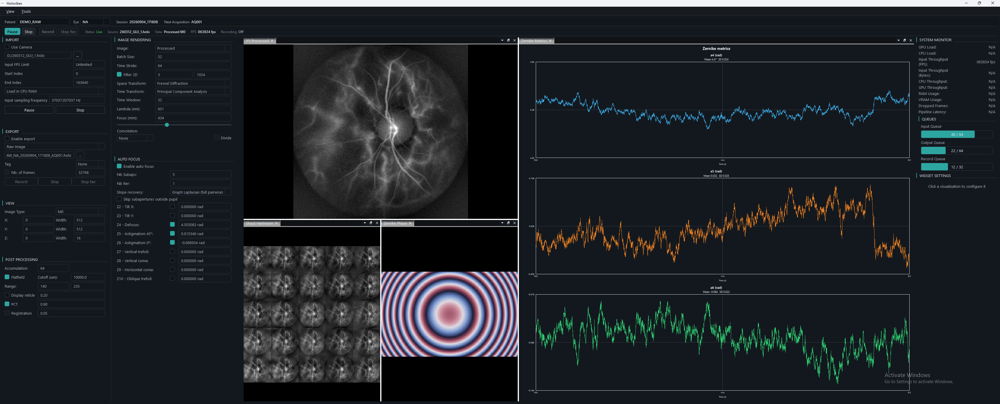
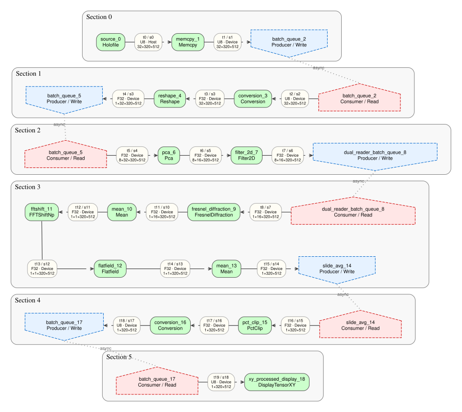

# Holoflow

Holoflow is a graph-based high-performance computing (HPC) framework for real-time scientific imaging, with first-class support for GPU-accelerated processing and laser Doppler holography.

## I'm looking for Holovibes!

Holovibes is the graphical user interface (GUI) built on top of Holoflow to support our laboratory experiments and clinical studies.
It integrates many of our Doppler holography routines, and features real-time wavefront analysis for aberration correction and measurements.

{ loading=lazy }
/// caption
Holovibes provides interactive control, visualization, and monitoring for scientific imaging pipelines.
///

## Why develop Holoflow?

Holoflow's requirements originates from the intersection of real-time high-throughput processing, complex mathematical and physical pipelines, a fast-growing ecosystem in which new computational methods appear weekly, and highly parameterized applications.
In practice, many domain scientists use NumPy[^numpy2020] or GPU-accelerated alternatives such as CuPy,[^cupy2017] JAX,[^jax2018] and PyTorch[^pytorch2019] because these libraries abstract implementation details and let researchers focus on equations.

However, a focused benchmark of a representative micro-batch laser Doppler holography pipeline found that python-based implementations could not match the performance of optimized C++/CUDA, which was approximately 74–267% faster depending on the platform[^guillou2027].
Reaching the required throughput still required significant HPC expertise and low-level optimization. Holoflow aims to add a first-class Windows backend for predictable, high-throughput general-purpose scientific computing (GPSC) while retaining a high-level interface.

{ loading=lazy }
/// caption
Example Holoflow processing graph, derived from the laser Doppler holography processing described by Puyo et al.[^puyo2018]
///

<figure>
  <video width="512" autoplay loop muted playsinline>
    <source src="assets/videos/DEMO_RAW_NA_20260904_153832_AQ004_60fps_512x512.mp4" type="video/mp4">
  </video>
  <figcaption>Input interferometric frames acquired at 37 kHz</figcaption>
</figure>

<figure>
  <video width="512" autoplay loop muted playsinline>
    <source src="assets/videos/DEMO_PROCESSED_NA_20260904_153832_AQ002_60fps_512x512.mp4" type="video/mp4">
  </video>
  <figcaption>Laser Doppler angiography processed in real-time!</figcaption>
</figure>

The input interferograms and processed laser Doppler angiography shown above are derived from the dataset published by Atlan.[^atlan2025]

## From processing graph to real-time execution

Describe your processing pipelined as a declarative graph of computational tasks. No implementation details, no manual buffer management, just the maths.
Holoflow takes care of compiling and executing it efficiently!

The runtime manages tasks instantiation, GPU scheduling, memory, tensor lifetimes, synchronization, and data movement, allowing processing code to remain focused on the algorithms themselves.
Pipelines can combine acquisition, signal processing, reconstruction, analysis, and visualization while sustaining the high data rates required by modern scientific imaging systems.

Holoflow was developed for demanding digital holography workloads, but its execution model is designed for general-purpose scientific computing.

## Built as a modular stack

-   **Holoflow**

    Core graph runtime for task scheduling, tensor management, memory allocation, and GPU execution.

    [Explore Holoflow](holoflow/index.md)

-   **Holovibes**

    Interactive Qt application for real-time acquisition, holographic reconstruction, analysis, and visualization.

    [Explore Holovibes](holovibes/index.md)

-   **Curaii**

    RAII-based GPU, memory, tensor, and CUDA library abstractions used throughout the stack.

    [Explore Curaii](curaii/index.md)

-   **Holofile**

    Efficient reading and writing of the `.holo` format for high-throughput holographic acquisitions.

    [Explore Holofile](holofile/index.md)

[^puyo2018]: L. Puyo, M. Paques, M. Fink, J.-A. Sahel, and M. Atlan, “[In vivo laser Doppler holography of the human retina](https://hal.sorbonne-universite.fr/hal-01875560v1),” *Biomedical Optics Express*, vol. 9, no. 9, pp. 4113–4129, 2018. [https://doi.org/10.1364/BOE.9.004113](https://doi.org/10.1364/BOE.9.004113). See also the [site-wide reference](references.md#puyo-2018).

[^atlan2025]: M. Atlan, *Doppler Holography Measurements of the Eye Fundus in a Volunteer – May 27, 2025* [Data set]. Zenodo, 2025. [https://doi.org/10.5281/zenodo.16761111](https://doi.org/10.5281/zenodo.16761111). Licensed under [CC BY 4.0](https://creativecommons.org/licenses/by/4.0/). See also the [site-wide reference](references.md#atlan-2025).

[^numpy2020]: C. R. Harris, K. J. Millman, S. J. van der Walt, et al., “[Array programming with NumPy](https://doi.org/10.1038/s41586-020-2649-2),” *Nature*, vol. 585, no. 7825, pp. 357–362, 2020. See also the [site-wide reference](references.md#harris-2020).

[^cupy2017]: R. Okuta, Y. Unno, D. Nishino, S. Hido, and C. Loomis, “[CuPy: A NumPy-Compatible Library for NVIDIA GPU Calculations](https://github.com/cupy/cupy#reference),” in *Proceedings of the Workshop on Machine Learning Systems at NIPS 2017*, 2017. See also the [site-wide reference](references.md#okuta-2017).

[^jax2018]: J. Bradbury, R. Frostig, P. Hawkins, et al., “[JAX: composable transformations of Python+NumPy programs](https://github.com/jax-ml/jax#citing-jax),” software, 2018. See also the [site-wide reference](references.md#bradbury-2018).

[^pytorch2019]: A. Paszke, S. Gross, F. Massa, et al., “[PyTorch: An Imperative Style, High-Performance Deep Learning Library](https://papers.neurips.cc/paper_files/paper/2019/hash/bdbca288fee7f92f2bfa9f7012727740-Abstract.html),” in *Advances in Neural Information Processing Systems 32*, pp. 8024–8035, 2019. See also the [site-wide reference](references.md#paszke-2019).

[^guillou2027]: J. Guillou, J. Fabrizio, E. Carlinet, and M. Atlan, “Real-Time Scientific Computing in Python: The Cost of High-Level GPU Abstractions,” unpublished manuscript, 2027. See also the [site-wide reference](references.md#guillou-2027).
